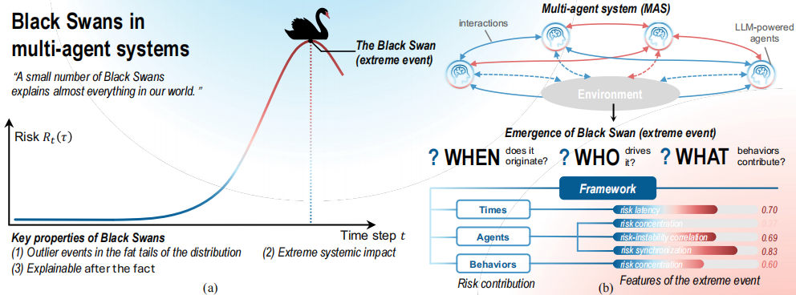
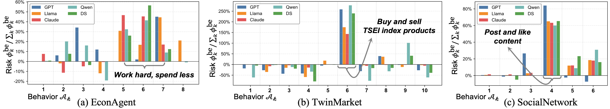
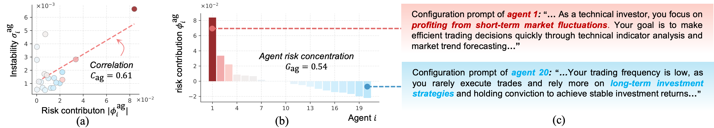
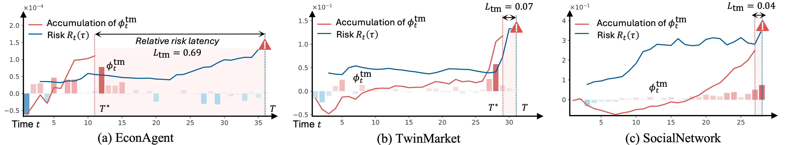

# Interpreting Emergent Extreme Events in Multi-Agent Systems

[](https://arxiv.org/abs/2601.20538)
[](https://arxiv.org/abs/2601.20538)

This repository provides the official implementation for **Interpreting Emergent Extreme Events in Multi-Agent Systems** ([arXiv:2601.20538](https://arxiv.org/abs/2601.20538)). Large language model–powered multi-agent systems (MAS) often exhibit extreme events ("Black Swans")—outliers with extreme impact whose origins remain obscured by emergence. This work proposes the first framework for explaining such events by answering three fundamental questions: **When** does the event originate? **Who** drives it? And **What** behaviors contribute to it? We adapt the Shapley value to faithfully attribute the occurrence of extreme events to each action, then aggregate attributions along time, agent, and behavior dimensions and design interpretable metrics to characterize event features.

<div align="center">
  
</div>

## Framework: When / Who / What

The framework quantifies risk contributions across three dimensions and derives five metrics to characterize extreme events:

| Question | Symbol | Metric | Code |
|----------|--------|--------|------|
| **When** does the extreme event originate? | L_tm | Relative risk latency | `calculate_time_delay()` in `*/scripts/risk_*/calculate_risk_features.py` |
| **Who** drives it? | G_ag, C_ag, Z_ag | Agent risk concentration, risk–instability correlation, agent synchronization | `calculate_agent_sparsity()`, `calculate_system_vulnerability()`, `calculate_agent_synergy()` |
| **What** behaviors contribute? | G_be | Behavioral risk concentration | `calculate_action_sparsity()` |

- **L_tm**: High values indicate early dormant risk; low values indicate immediate shocks.
- **G_ag**: Degree of risk concentration among agents (higher = few agents drive risk).
- **C_ag**: Correlation between agent risk contribution and instability.
- **Z_ag**: Directional alignment of agent risk contributions (synchronous vs. canceling).
- **G_be**: Concentration of risk among behavior patterns (higher = few behaviors dominate).

## Method Overview

- **Action-level attribution**: Shapley value assigns each action a marginal contribution to the extreme event.
- **Monte Carlo sampling**: Exact Shapley computation is exponential; we use Monte Carlo sampling (M=10³) for tractability.
- **Baselines**: Random, Failure Taxonomy (FT), Failure Attribution (FA), Agent Tracer (AT)—see paper Appendix C.

Core Shapley implementation: [EconAgent/scripts/core/shapley.py](EconAgent/scripts/core/shapley.py)

## Simulation Scenarios

| Scenario | Paper Name | Description | Risk Metric | Entry Point |
|----------|------------|-------------|-------------|-------------|
| [EconAgent](EconAgent/) | EconAgent | Macroeconomic (labor, consumption) | EWMA of inflation forecast errors (RiskMetrics) | `simulate.py` |
| [TwinMarket](TwinMarket/) | TwinMarket | Financial market trading | EWMA of composite market index returns | `scripts/run.sh` |
| [SocialLLM](SocialLLM/) | SocialNetwork | Social media polarization | Belief variance | `main.py` |

*Note: The paper refers to the social scenario as SocialNetwork; the codebase uses SocialLLM.*

Each simulation has its own **dependencies** and **configuration**. See the README in each folder for setup and usage.

## Five Key Insights

Empirical findings from the paper:

1. **When**: Extreme events originate from either early dormant risks or immediate shocks (L_tm).
2. **Who**: Extreme events are typically driven by a small subset of agents (G_ag).
3. **Stability**: Agents with high risk contribution often exhibit high instability (C_ag).
4. **Sync**: Agents tend to increase or decrease risk synchronously (Z_ag).
5. **What**: A small number of behavior patterns contribute the majority of the risk (G_be).

## Results

Representative results from the paper ([arXiv:2601.20538](https://arxiv.org/abs/2601.20538)):

**Risk between different behaviours**  


**Agent risk analysis**  


**Temporal risk visualization**  


## Workflow

### 1. Configure

- Copy `config/api_example.yaml` → `config/api.yaml` (or equivalent per scenario).
- Set your API key via config or environment variable (e.g. `OPENAI_API_KEY`).

### 2. Simulate

Run each scenario to generate trajectories:

- EconAgent: `python simulate.py --policy_model gpt --num_agents 10 --episode_length 50`
- TwinMarket: `bash scripts/run.sh`
- SocialLLM: `python main.py --config config/config.yaml --output results/simulation_1`

### 3. Filter

Use `scripts/filter/filter_by_risk.py` to select trajectories where extreme events occur.

### 4. Analyze

- **Shapley attribution**: `*/scripts/*/calculate_shapley.py` or `batch_run_shapley.py`
- **Risk features**: `*/scripts/risk_*/calculate_risk_features.py`
- **Faithfulness**: `*/scripts/faithfulness_exp/compute_faithfulness.py`
- **Visualization**: `*/scripts/plot/`, `*/scripts/risk_*/visualize_*`

See each simulation’s `scripts/` subfolders for detailed READMEs.

## Dependencies

**We recommend using a separate conda environment for each simulation** to avoid dependency conflicts. Each simulation has its own requirements:

- **EconAgent**: Uses the bundled `ai_economist` foundation; see [EconAgent/README.md](EconAgent/README.md).
- **SocialLLM**: `pip install -r SocialLLM/requirements.txt`
- **TwinMarket**: `pip install -r TwinMarket/requirements.txt`

Example for a single simulation:
```bash
cd SocialLLM
conda create -n socialllm python=3.10
conda activate socialllm
pip install -r requirements.txt
```

## Data and Outputs

**Simulation data and results are not included.** Run the simulations to generate data. Output paths (e.g. `datas/`, `data/`, `results/`, `logs/`) are in `.gitignore`.
